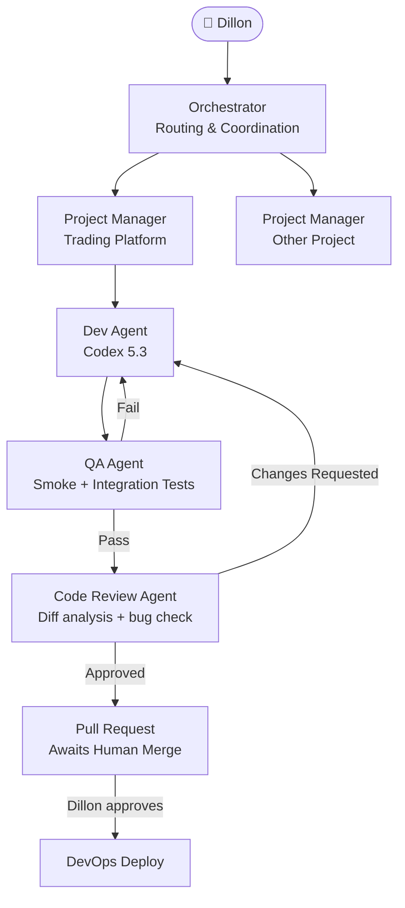
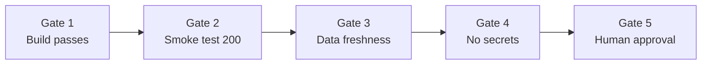

# AIEnhance v2 — Agent Architecture Diagram

## Full Pipeline

```mermaid
flowchart TD
    User([👤 Dillon]) --> Orch[Orchestrator\nRouting & Coordination]
    Orch --> PM1[Project Manager\nTrading Platform]
    Orch --> PM2[Project Manager\nOther Project]
    PM1 --> Dev[Dev Agent\nCodex 5.3]
    Dev --> QA[QA Agent\nSmoke + Integration Tests]
    QA -->|Pass| CR[Code Review Agent\nDiff analysis + bug check]
    QA -->|Fail| Dev
    CR -->|Approved| PR[Pull Request\nAwaits Human Merge]
    CR -->|Changes Requested| Dev
    PR -->|Dillon approves| Deploy[DevOps Deploy]
```

## Quality Gates

```mermaid
flowchart LR
    G1[Gate 1\nBuild passes] --> G2[Gate 2\nSmoke test 200] --> G3[Gate 3\nData freshness] --> G4[Gate 4\nNo secrets] --> G5[Gate 5\nHuman approval]
```
