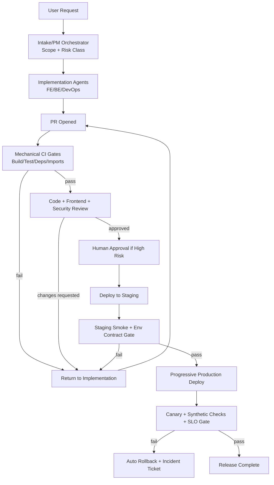

# AIEnhance Agent System Audit — What It Solves vs What’s Missing

**Date:** 2026-02-19  
**Scope reviewed:**
- `~/.openclaw/workspaces/orchestrator/SOUL.md`
- `~/.openclaw/workspaces/orchestrator/AGENTS.md`
- `~/.openclaw/workspaces/orchestrator/learnings/ERRORS.md`
- `~/.openclaw/shared/bmad-openclaw/prompts/*.md`

---

## Section 1: What our system currently has

### 1.1 Agent roles and prompts currently defined

### A) Roles defined in `SOUL.md` (canonical orchestration intent)

**Persistent agents (3):**
1. `devops` — infra, CI/CD, deploy
2. `researcher` — research/CVEs/fact-checking
3. `security-reviewer` — OWASP/dependency security

**Frontend gate role (1):**
4. `frontend-lead` — mandatory frontend PR quality gate

**BMAD spawned roles (12):**
5. `product-owner` → `prompts/product-owner.md`
6. `business-analyst` → `prompts/business-analyst.md`
7. `architect` → `prompts/architect.md`
8. `ux-designer` → `prompts/ux-designer.md`
9. `scrum-master` → `prompts/scrum-master.md`
10. `readiness-check` → `prompts/readiness-check.md`
11. `create-story` → `prompts/create-story.md`
12. `dev-story` → `prompts/dev-story.md`
13. `code-review` → `prompts/code-review.md`
14. `ux-review` → `prompts/ux-review.md`
15. `qa-tester` → `prompts/qa-tester.md`
16. `retrospective` → `prompts/retrospective.md`

**Enhancement prompt (injected):**
- `frontend-design` → `prompts/frontend-design.md` (to dev-story/ux-designer for UI work)

### B) Roles defined in `AGENTS.md` (actual team file currently loaded)

1. `frontend-lead` (Sonnet 4.6)
2. `frontend-dev` (GPT-5.3-Codex)
3. `backend-dev` (GPT-5.3-Codex)
4. `devops` (Sonnet 4.5)
5. `qa-tester` (Sonnet 4.5)
6. `tech-lead` (Opus 4.6)
7. `researcher` (Haiku 4.5)

### C) Prompt files found in `~/.openclaw/shared/bmad-openclaw/prompts/`

- `architect.md`
- `business-analyst.md`
- `code-review.md`
- `create-story.md`
- `dev-story.md`
- `frontend-design.md`
- `frontend-lead.md`
- `product-owner.md`
- `qa-tester.md`
- `readiness-check.md`
- `retrospective.md`
- `scrum-master.md`
- `ux-designer.md`
- `ux-review.md`

### 1.2 Workflow pipeline that exists (documented)

### Planning phase (SOUL/BMAD)
1. Product Owner → product brief
2. Business Analyst → PRD
3. Architect → architecture + ADRs
4. UX Designer → UX specification
5. Scrum Master → epics/stories + sprint-status
6. Readiness Check → GO/NO-GO report

### Execution phase (per story)
1. Create Story
2. Dev Story (implementation + tests)
3. Code Review (adversarial)
   - loop back on CHANGES REQUESTED
4. Optional UX Review
5. Optional QA testing
6. Retrospective

### Alternate operational flow in `AGENTS.md`
Feature flow: backend-dev → frontend-dev → qa-tester → tech-lead → devops → qa smoke test.

### 1.3 Quality gates defined (on paper)

- “No shortcuts” quality sequence in both SOUL/AGENTS.
- Mandatory frontend review gate (`frontend-lead`) for frontend file patterns.
- Readiness gate before implementation (`readiness-check`: GO/NO-GO).
- Adversarial code review requires findings and can bounce work back.
- Dev-story requires red-green-refactor + full tests before review.
- QA-tester requires AC-based test plan and report.
- Review cycle cap (max 3 cycles, then escalate) in SOUL.
- Sprint status discipline (`backlog|ready-for-dev|in-progress|review|done`).

---

## Section 2: What the system enforces vs what it only suggests

## 2.1 Truly enforced (mechanically hard constraints)

These are enforced by runtime/platform constraints, not by agent goodwill:

1. **Tool permission boundaries in the session runtime**
   - Only exposed tools can be called.
2. **File existence/path reality**
   - If file missing, reads/writes fail.
3. **Whatever is encoded in external CI/CD or repo protections**
   - Not evidenced in reviewed files; therefore unknown/likely absent.

**Important:** From the files reviewed, there is **no demonstrated hard merge gate**, no required CI status check, and no mandatory branch protection shown.

## 2.2 Suggested/prompt-level rules (bypassable)

These are instructions, not enforcement:

- “Always use `sessions_spawn`.”
- “Never do direct execution work as orchestrator.”
- “Run tests/build/lint before done.”
- “Quality pipeline: implementation → QA → review → deploy.”
- “Mandatory frontend lead before merge.”
- “Readiness GO/NO-GO before implementation.”
- “Max 3 review cycles.”
- “Model policy must use exact model.”

All of the above can be ignored by an agent unless an external controller blocks actions.

## 2.3 Example: “run pnpm build before PR”

In this system, this type of rule is currently **suggested, not enforced** unless:
- CI runs build automatically on PR, **and**
- branch protection blocks merge on failing/missing CI.

No evidence of such mandatory enforcement is present in reviewed orchestration/prompt files.

## 2.4 Critical consistency problem: policy drift

`SOUL.md` and `AGENTS.md` disagree on:
- agent roster,
- model policy,
- execution pattern (`sessions_spawn` vs `sessions_send` pipelines),
- existence of security-reviewer and BMAD chain vs simpler FE/BE/QA/tech-lead flow.

Result: agents can choose conflicting “truths,” weakening compliance further.

---

## Section 3: What broke today and why (gate analysis)

Below, “Should have caught” = ideal gate; “Gate existed?” = whether documented gate appears in current system artifacts.

### 1) Improvement loop auto-merged 37 PRs without testing → production outages
- **Should have caught:**
  - Required CI checks (build/test/smoke) + required reviewer approvals + staged deploy gate.
  - Merge throttle (no bulk auto-merge without health checks).
- **Gate existed?**
  - **Only as guidance.** “No shortcuts” exists in docs, but no hard merge blocking mechanism shown.
- **Root cause:**
  - Autonomy allowed to merge at speed without mechanical quality barriers.

### 2) `docker compose up` wrong port bindings → 502
- **Should have caught:**
  - DevOps preflight gate (port mapping validation),
  - post-deploy synthetic health check (ingress→service reachability),
  - rollout verification before traffic cutover.
- **Gate existed?**
  - **Not enforced.** DevOps role exists, but no mandatory preflight automation documented.
- **Root cause:**
  - Infrastructure changes lacked executable checklists and blocking health probes.

### 3) Missing `vectorbt`, `jose`, `passlib` in requirements → API crash
- **Should have caught:**
  - Dependency lock/sync gate,
  - import validation in CI,
  - startup smoke test of API container.
- **Gate existed?**
  - **No hard gate shown.**
- **Root cause:**
  - No automated dependency completeness check before merge/deploy.

### 4) `anomaly_router` imported but file missing → API crash
- **Should have caught:**
  - Static import/path validation,
  - test that imports app package,
  - boot test in CI.
- **Gate existed?**
  - **Suggested only** (code review/QA), not mechanical.
- **Root cause:**
  - Basic compile/import sanity not required before promotion.

### 5) bcrypt version incompatibility → API crash
- **Should have caught:**
  - Dependency compatibility test matrix,
  - container build + runtime boot test,
  - pinned/validated dependency policy.
- **Gate existed?**
  - **No explicit enforced gate** in reviewed docs.
- **Root cause:**
  - Dependency policy is advisory, not validated in CI.

### 6) OHLC endpoint returned 2021 data → no candles
- **Should have caught:**
  - Data freshness contract tests,
  - business-logic acceptance tests with current date windows,
  - monitoring alert on stale market data.
- **Gate existed?**
  - QA exists in theory, but freshness assertions not mandated in prompts.
- **Root cause:**
  - Missing domain-specific test gates (freshness/SLA semantics).

### 7) `NEXT_PUBLIC_API_URL` baked at build time, not runtime → login hit localhost
- **Should have caught:**
  - Environment contract tests for build-time vs runtime variables,
  - deployment smoke tests from real frontend URL,
  - config policy gate for frontend env handling.
- **Gate existed?**
  - **Not explicitly enforced.**
- **Root cause:**
  - No deterministic environment/config validation before release.

---

## Section 4: Gaps — what the system is missing (prioritized)

## P0 (would likely have prevented today’s outages)

1. **Hard merge protections (required checks + approvals)**
   - Block merge without passing build/test/import/startup smoke.
2. **Promotion gate with deploy health checks**
   - Block rollout if `/health`, auth flow, and key API smoke fail.
3. **Dependency integrity gate**
   - Fail CI on missing imports / unsynced requirements / incompatible versions.
4. **Config/env contract gate**
   - Validate required env vars and build-vs-runtime semantics (especially frontend public vars).
5. **Bulk-change circuit breaker**
   - Cap auto-merges; require human approval after N merges or any failure.

## P1 (production reliability at scale)

1. **Single source of truth for agent policy**
   - Reconcile `SOUL.md` vs `AGENTS.md` drift.
2. **Explicit release manager role**
   - owns go/no-go and staged rollout, not dev agent.
3. **Domain test packs**
   - e.g., OHLC freshness and trading-data correctness suites.
4. **Automated post-deploy observability gates**
   - error budget checks, alerting, rollback triggers.
5. **Artifact-based workflow controller**
   - state machine that prevents skipping required steps.

## P2 (nice-to-have)

1. **Scorecards per agent run** (quality, escaped defects, review churn).
2. **Prompt linting + policy conformance tests** for agent prompts.
3. **Historical RCA knowledge base** auto-linked from `ERRORS.md` to gating rules.
4. **Canary + progressive delivery UX dashboards** for non-engineering oversight.

---

## Section 5: Proposed new architecture

## 5.1 New/adjusted roles needed

1. **Intake/PM Orchestrator**
   - converts request to scoped change packet + risk level.
2. **Implementation Agents** (FE/BE/DevOps) 
   - unchanged core coding roles.
3. **Quality Gatekeeper (mechanical)**
   - not just an LLM reviewer; executes mandatory checks and blocks progression.
4. **Release Manager Agent**
   - controls staging/prod promotion using objective signals.
5. **SRE/Observability Agent**
   - validates runtime health, alerts, rollback signals.
6. **Security/Dependency Gate Agent**
   - SBOM/dependency compatibility/import/runtime security checks.
7. **Human Approval Layer (policy-based)**
   - required for high-risk or batched merges.

## 5.2 New gates needed (what, where, how enforced)

1. **PR Creation Gate (enforced in CI):**
   - lint, typecheck, unit/integration, import scan, dependency sync check.
2. **Pre-Merge Gate (repo protection):**
   - required checks + required reviewers + no bypass except admins.
3. **Pre-Deploy Gate (staging):**
   - docker compose validation, env contract validation, startup smoke.
4. **Post-Deploy Gate (production canary):**
   - synthetic auth flow, critical endpoint checks, error-rate threshold.
5. **Auto-Rollback Gate:**
   - automatic rollback on failed health/error budget breach.
6. **Change Velocity Gate:**
   - block mass auto-merge unless explicit human override.

## 5.3 Proposed workflow

User request → planning + risk classification → implementation in isolated branches/worktrees → mandatory automated gates → human approval for risk classes → staged deploy → production canary + monitors → complete/rollback.

---

## Key conclusion

Current system is strong in **role design and written process**, but weak in **mechanical enforcement**. Today’s failures are consistent with a system where gates are mostly advisory. The highest-value fix is to convert critical gates from prompt text into hard, automated controls (CI, branch protection, staged deploy checks, and rollback automation).